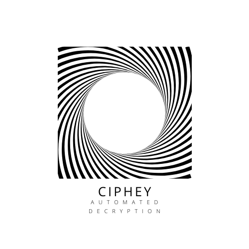

<p align="center">
  
</p>


<p align="center">
  
  
</p>


# What is this?
Ciphey is an automated decryption tool.
You put in encrypted text, and it outputs the decrypted text.

> "What type of encryption?"

That's the point. You don't know. Ciphey will find out and do it for you.

# How does it work?
You input a string (via a file, or via a terminal)

Ciphey uses a Deep Neural Network to create a probability distribution (softmax). 

This distribution gives how likely it is to be a hash, a basic encoding (hex, binary) or encryption (such as caeser, aes etc)
Ciphey will then work through each cipher to try and decode it.

Ciphey uses the language module (app/languageChecker) to determine both the language something is written in, and whether or not that string is valid in that language. So Ciphey would say "hello my name is whiteboard" is English. But it wouldn't say "iaid i2iv ria9i" is a language.

Using the probability distribution, Ciphey calls each object on a new thread. Yes, Ciphey is **multi-threaded**.

Ciphey is designed from the groundup to be as fast as physically possible. The second it sees the answer, it will stop and return that answer.

# What encryptions can Ciphey deal with?
Not just encryptions, but hashes and encodings too.

* Vigenère cipher
* Affine cipher
* Transposition Cipher
* Pig Latin
* Morse Code
* Ascii
* Binary
* Base64
* Hexadecimal
* Caesar Cipher
* Reverse (palindrome)
* Sha512
* MD5
* Sha1
* Sha384
* Sha256

# How to install
```
pip3 install ciphey
```

# How to use

In Terminal:

```
ciphey
```

# The internal data packet
This is the data packet specification Ciphey uses. To pass data around the different modules and to language checker, it is neccesary to use an internal data packet.
```python
{"lc": self.lc, "IsPlaintext?": True, "Plaintext": translated, "Cipher": "Caesar", "Extra Information": "The rotation used is {counter}"}
```

# How to contribute
Ciphey is always in need of more decryption tools! 
1. Write a decryption tool (this can include encodings such as Base64 too). Make sure it has a `decrypt` function and is a class.
2. For each possible decryption, call `self.lc.checkLanguage(translated)` where `translated` is the decrypted text.
**Note** by default, all decryption modules when instantiated get passed Language Checker (lc). Look at this for example:
```python
    def __init__(self, lc):
        self.lc = lc
```
3. If result returns `True`, it is successfully decrypted to English. Return the internal data packet but make sure to change the information to match your decryption module.
4. Create a new object in the parent class. For example, in Encoding the parent is `encodingParent.py`. Simply add your object to the list of other objects. For `encodingParent.py` this list of objects is currently:
```python
        self.binary = Binary(self.lc)
        self.base64 = Base64(self.lc)
        self.ascii = Ascii(self.lc)
        self.hex = Hexadecimal(self.lc)
        self.morse = MorseCode(self.lc)
```
And then add the new object to the list of objects:
```python
self.list_of_objects = [self.caesar, self.reverse, self.pig]
```
5. It'd be nice if you wrote some tests for it, but if you don't know much about testing no worries! I can write the tests for you :)
6. I'll put your name on the list of contributors!
