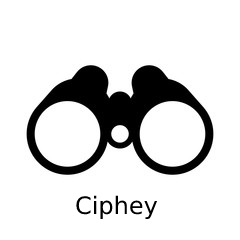

Translations  
<a href=https://github.com/Ciphey/Ciphey/tree/master/translations/id/README.md>🇮🇩 ID   </a>
<a href=https://github.com/Ciphey/Ciphey/tree/master/translations/it/README.md>🇮🇹 IT   </a>
<a href=https://github.com/Ciphey/Ciphey/tree/master/translations/de/README.md>🇩🇪 DE   </a>
<a href=https://github.com/Ciphey/Ciphey/tree/master/translations/hu/README.md>🇭🇺 HU   </a>
<a href=https://github.com/Ciphey/Ciphey/tree/master/translations/nl/README.md>🇳🇱 NL   </a>
<a href=https://github.com/Ciphey/Ciphey/tree/master/translations/pt-br/README.md>🇧🇷 PT-BR   </a>
<a href=https://github.com/Ciphey/Ciphey/tree/master/translations/ru/README.md>🇷🇺 RU   </a>
<a href=https://github.com/Ciphey/Ciphey/tree/master/translations/fr/README.md>🇫🇷 FR   </a>
<a href=https://github.com/Ciphey/Ciphey/tree/master/translations/zh/README.md>🇨🇳 ZH   </a>
   
➡️
<a href="https://github.com/Ciphey/Ciphey/wiki">Documentation</a> |
<a href="https://discord.ciphey.online">Discord</a> |
 <a href="https://github.com/Ciphey/Ciphey/wiki/Installation">Installation Guide</a>
 ⬅️

 
  

  

 
  

  

  
 
Fully automated decryption/decoding/cracking tool using natural language processing & artificial intelligence, along with some common sense.

## [Installation Guide](https://github.com/Ciphey/Ciphey/wiki/Installation)

| 
<a href="https://pypi.org/project/ciphey">ğŸ Python | 
<a href="https://pypi.org/project/ciphey">🋠Docker (Universal) |
| --------------------------------------------------------------------- | --------------------------------------------------------------------------------- |
| 

    | 

                |
| `python3 -m pip install ciphey --upgrade`                             | `docker run -it --rm remnux/ciphey`                                               |

| Linux                                                                                                                   | Mac OS                                                                                                                     | Windows                                                                                                                   |
| ----------------------------------------------------------------------------------------------------------------------- | -------------------------------------------------------------------------------------------------------------------------- | ------------------------------------------------------------------------------------------------------------------------- |
|  |  |  |

# 🤔 What is this?

Input encrypted text, get the decrypted text back.

> "What type of encryption?"

That's the point. You don't know, you just know it's possibly encrypted. Ciphey will figure it out for you.

Ciphey can solve most things in 3 seconds or less.

  

Ciphey aims to be a tool to automate a lot of decryptions & decodings such as multiple base encodings, classical ciphers, hashes or more advanced cryptography.

If you don't know much about cryptography, or you want to quickly check the ciphertext before working on it yourself, Ciphey is for you.

**The technical part.** Ciphey uses a custom built artificial intelligence module (_AuSearch_) with a _Cipher Detection Interface_ to approximate what something is encrypted with. And then a custom-built, customisable natural language processing _Language Checker Interface_, which can detect when the given text becomes plaintext.

No neural networks or bloated AI here. We only use what is fast and minimal.

And that's just the tip of the iceberg. For the full technical explanation, check out our [documentation](https://github.com/Ciphey/Ciphey/wiki).

# ✨ Features

- **30+ encryptions supported** such as encodings (binary, base64) and normal encryptions like Caesar cipher, repeating-key XOR and more. **[For the full list, click here](https://github.com/Ciphey/Ciphey/wiki/Supported-Ciphers)**
- **Custom Built Artificial Intelligence with Augmented Search (AuSearch) for answering the question "what encryption was used?"** Resulting in decryptions taking less than 3 seconds.
- **Custom built natural language processing module** Ciphey can determine whether something is plaintext or not. Whether that plaintext is JSON, a CTF flag, or English, Ciphey can get it in a couple of milliseconds.
- **Multi Language Support** at present, only German & English (with AU, UK, CAN, USA variants).
- **Supports encryptions and hashes** Which the alternatives such as CyberChef Magic do not.
- **[C++ core](https://github.com/Ciphey/CipheyCore)** Blazingly fast.

# 🔭 Ciphey vs CyberChef

## 🔁 Base64 Encoded 42 times

<table>
  <tr>
  <th>Name</th>
    <th>⚡ Ciphey ⚡ </th>
    <th>🐢 CyberChef 🐢</th>
  </tr>
  <tr>
  <th>Gif</th>
    <td></td>
    <td></td>
  </tr>
  <tr>
  <th>Time</th>
    <td>2 seconds</td>
    <td>6 seconds</td>
  </tr>
    <tr>
  <th>Setup</th>
    <td><ul><li>Run ciphey on the file</li></ul></td>
    <td><ul><li>Set the regex param to "{"</li><li>You need to know how many times to recurse</li><li>You need to know it's Base64 all the way down</li><li>You need to load CyberChef (it's a bloated JS app)</li><li>Know enough about CyberChef to create this pipeline</li><li>Invert the match</li></ul></td>
  </tr>
</table>

<b>Note</b> The gifs may load at different times, so one may appear significantly faster than another. 
<b>A note on magic </b>CyberChef's most similar feature to Ciphey is Magic. Magic fails instantly on this input and crashes. The only way we could force CyberChef to compete was to manually define it.

We also tested CyberChef and Ciphey with a **6gb file**. Ciphey cracked it in **5 minutes and 54 seconds**. CyberChef crashed before it even started.

## 📊 Ciphey vs Katana vs CyberChef Magic

| **Name**                                   | ⚡ Ciphey ⚡ | 🗡️ Katana 🗡️ | 🐢 CyberChef Magic 🐢 |
| ------------------------------------------ | ------------ | ------------ | --------------------- |
| Advanced Language Checker                  | ✅           | ❌           | ✅                    |
| Supports Encryptions                       | ✅           | ✅           | ❌                    |
| Releases named after Dystopian themes 🌃   | ✅           | ❌           | ❌                    |
| Supports hashes                            | ✅           | ✅           | ❌                    |
| Easy to set up                             | ✅           | ❌           | ✅                    |
| Can guess what something is encrypted with | ✅           | ❌           | ❌                    |
| Created for hackers by hackers             | ✅           | ✅           | ❌                    |

# 🎬 Getting Started

If you're having trouble with installing Ciphey, [read this.](https://github.com/Ciphey/Ciphey/wiki/Common-Issues-&-Their-Solutions)

## ‼️ Important Links (Docs, Installation guide, Discord Support)

| Installation Guide                                                          | Documentation                                             | Discord                                     | Docker Image (from REMnux)                                                                          |
| --------------------------------------------------------------------------- | --------------------------------------------------------- | ------------------------------------------- | --------------------------------------------------------------------------------------------------- |
| 📖 [Installation Guide](https://github.com/Ciphey/Ciphey/wiki/Installation) | 📚 [Documentation](https://github.com/Ciphey/Ciphey/wiki) | 🦜 [Discord](https://discord.ciphey.online) | 🐋 [Docker Documentation](https://docs.remnux.org/run-tools-in-containers/remnux-containers#ciphey) |

## 🏃‍♀️Running Ciphey

There are 3 ways to run Ciphey.

1. File Input `ciphey -f encrypted.txt`
2. Unqualified input `ciphey -- "Encrypted input"`
3. Normal way `ciphey -t "Encrypted input"`

To get rid of the progress bars, probability table, and all the noise use the quiet mode.

`ciphey -t "encrypted text here" -q`

For a full list of arguments, run `ciphey --help`.

### ⚗️ Importing Ciphey

You can import Ciphey\'s main and use it in your own programs and code. `from Ciphey.__main__ import main`

# 🎪 Contributors

Ciphey was invented by [Brandon](https://github.com/bee-san) in 2008, and revived in 2019. Ciphey wouldn't be where it was today without [Cyclic3](https://github.com/Cyclic3) - president of UoL's Cyber Security Society.

Ciphey was revived & recreated by the [Cyber Security Society](https://www.cybersoc.cf/) for use in CTFs. If you're ever in Liverpool, consider giving a talk or sponsoring our events. Email us at `cybersecurity@society.liverpoolguild.org` to find out more 🤠

**Major Credit** to George H for working out how we could use proper algorithms to speed up the search process.
**Special thanks** to [varghalladesign](https://www.facebook.com/varghalladesign) for designing the logo. Check out their other design work!

## 🐕‍🦺 [Contributing](https://github.com/Ciphey/Ciphey/wiki/Contributing)

Don't be afraid to contribute! We have many, many things you can do to help out. Each of them labelled and easily explained with examples. If you're trying to contribute but stuck, tag @bee-san or @cyclic3 in the GitHub issue ✨

Alternatively, join the Discord group and send a message there (link in [contrib file](https://github.com/Ciphey/Ciphey/wiki/Contributing)) or at the top of this README as a badge.

Please read the [contributing file](https://github.com/Ciphey/Ciphey/wiki/Contributing) for exact details on how to contribute ✨

By doing so, you'll get your name added to the README below and get to be apart of an ever-growing project!

## 💰 Financial Contributors

The contributions will be used to fund not only the future of Ciphey and its authors, but also Cyber Security Society at the University of Liverpool.

GitHub doesn't support "sponsor this project and we'll evenly distribute the money", so pick a link and we'll sort it out on our end 🥰

## ✨ Contributors

Thanks goes to these wonderful people ([emoji key](https://allcontributors.org/docs/en/emoji-key)):

<!-- ALL-CONTRIBUTORS-LIST:START - Do not remove or modify this section -->
<!-- prettier-ignore-start -->
<!-- markdownlint-disable -->
<table>
  <tr>
    <td align="center"><a href="https://github.com/Cyclic3"> <b>cyclic3</b></a> <a href="#design-cyclic3" title="Design">🎨</a> <a href="#maintenance-cyclic3" title="Maintenance">🚧</a> <a href="https://github.com/Ciphey/Ciphey/commits?author=cyclic3" title="Code">💻</a> <a href="#ideas-cyclic3" title="Ideas, Planning, & Feedback">🤔</a></td>
    <td align="center"><a href="https://skerritt.blog"> <b>Brandon</b></a> <a href="#design-brandonskerritt" title="Design">🎨</a> <a href="#maintenance-brandonskerritt" title="Maintenance">🚧</a> <a href="https://github.com/Ciphey/Ciphey/commits?author=brandonskerritt" title="Code">💻</a> <a href="#ideas-brandonskerritt" title="Ideas, Planning, & Feedback">🤔</a></td>
    <td align="center"><a href="https://github.com/michalani"> <b>michalani</b></a> <a href="https://github.com/Ciphey/Ciphey/commits?author=michalani" title="Code">💻</a></td>
    <td align="center"><a href="https://github.com/ashb07"> <b>ashb07</b></a> <a href="https://github.com/Ciphey/Ciphey/commits?author=ashb07" title="Code">💻</a></td>
    <td align="center"><a href="https://github.com/TheAlcanian"> <b>Shardion</b></a> <a href="https://github.com/Ciphey/Ciphey/issues?q=author%3ATheAlcanian" title="Bug reports">🐛</a></td>
    <td align="center"><a href="https://github.com/Bryzizzle"> <b>Bryan</b></a> <a href="#translation-Bryzizzle" title="Translation">🌍</a> <a href="https://github.com/Ciphey/Ciphey/commits?author=Bryzizzle" title="Documentation">📖</a></td>
    <td align="center"><a href="https://lukasgabriel.net"> <b>Lukas Gabriel</b></a> <a href="https://github.com/Ciphey/Ciphey/commits?author=lukasgabriel" title="Code">💻</a> <a href="https://github.com/Ciphey/Ciphey/issues?q=author%3Alukasgabriel" title="Bug reports">🐛</a> <a href="#translation-lukasgabriel" title="Translation">🌍</a> <a href="#ideas-lukasgabriel" title="Ideas, Planning, & Feedback">🤔</a></td>
  </tr>
  <tr>
    <td align="center"><a href="https://github.com/DarshanBhoi"> <b>Darshan</b></a> <a href="https://github.com/Ciphey/Ciphey/issues?q=author%3ADarshanBhoi" title="Bug reports">🐛</a></td>
    <td align="center"><a href="https://github.com/SkeletalDemise"> <b>SkeletalDemise</b></a> <a href="https://github.com/Ciphey/Ciphey/commits?author=SkeletalDemise" title="Code">💻</a></td>
    <td align="center"><a href="https://www.patreon.com/cclauss"> <b>Christian Clauss</b></a> <a href="https://github.com/Ciphey/Ciphey/commits?author=cclauss" title="Code">💻</a> <a href="https://github.com/Ciphey/Ciphey/issues?q=author%3Acclauss" title="Bug reports">🐛</a></td>
    <td align="center"><a href="http://machinexa.xss.ht"> <b>Machinexa2</b></a> <a href="#content-machinexa2" title="Content">🖋</a></td>
    <td align="center"><a href="https://github.com/anantverma275"> <b>Anant Verma</b></a> <a href="https://github.com/Ciphey/Ciphey/commits?author=anantverma275" title="Code">💻</a> <a href="https://github.com/Ciphey/Ciphey/issues?q=author%3Aanantverma275" title="Bug reports">🐛</a></td>
    <td align="center"><a href="https://github.com/XVXTOR"> <b>XVXTOR</b></a> <a href="https://github.com/Ciphey/Ciphey/commits?author=XVXTOR" title="Documentation">📖</a></td>
    <td align="center"><a href="https://github.com/Itamikame"> <b>Itamikame</b></a> <a href="https://github.com/Ciphey/Ciphey/commits?author=Itamikame" title="Code">💻</a></td>
  </tr>
  <tr>
    <td align="center"><a href="https://github.com/MikeMerz"> <b>MikeMerz</b></a> <a href="https://github.com/Ciphey/Ciphey/commits?author=MikeMerz" title="Code">💻</a></td>
    <td align="center"><a href="https://github.com/jacobggman"> <b>Jacob Galam</b></a> <a href="https://github.com/Ciphey/Ciphey/commits?author=jacobggman" title="Code">💻</a> <a href="https://github.com/Ciphey/Ciphey/issues?q=author%3Ajacobggman" title="Bug reports">🐛</a></td>
    <td align="center"><a href="https://tuxthexplorer.github.io/"> <b>TuxTheXplorer</b></a> <a href="#translation-TuxTheXplorer" title="Translation">🌍</a></td>
    <td align="center"><a href="https://github.com/Itamai"> <b>Itamai</b></a> <a href="https://github.com/Ciphey/Ciphey/commits?author=Itamai" title="Code">💻</a> <a href="https://github.com/Ciphey/Ciphey/issues?q=author%3AItamai" title="Bug reports">🐛</a></td>
    <td align="center"><a href="https://github.com/Termack"> <b>Filipe</b></a> <a href="#translation-Termack" title="Translation">🌍</a></td>
    <td align="center"><a href="https://github.com/malathit"> <b>Malathi</b></a> <a href="https://github.com/Ciphey/Ciphey/commits?author=malathit" title="Code">💻</a></td>
    <td align="center"><a href="https://hexchaos.xyz/"> <b>Jack</b></a> <a href="#translation-HexChaos" title="Translation">🌍</a></td>
  </tr>
  <tr>
    <td align="center"><a href="https://github.com/yafkari"> <b>Younes</b></a> <a href="#translation-yafkari" title="Translation">🌍</a></td>
    <td align="center"><a href="https://gitlab.com/Marnick39"> <b>Marnick Vandecauter</b></a> <a href="#translation-Marnick39" title="Translation">🌍</a></td>
    <td align="center"><a href="https://github.com/mav8557"> <b>Michael V</b></a> <a href="https://github.com/Ciphey/Ciphey/commits?author=mav8557" title="Code">💻</a></td>
    <td align="center"><a href="https://github.com/chuinzer"> <b>chuinzer</b></a> <a href="#translation-chuinzer" title="Translation">🌍</a></td>
    <td align="center"><a href="https://github.com/blackcat-917"> <b>blackcat-917</b></a> <a href="#translation-blackcat-917" title="Translation">🌍</a></td>
  </tr>
</table>

<!-- markdownlint-enable -->
<!-- prettier-ignore-end -->

<!-- ALL-CONTRIBUTORS-LIST:END -->

This project follows the [all-contributors](https://github.com/all-contributors/all-contributors) specification. Contributions of any kind welcome!
