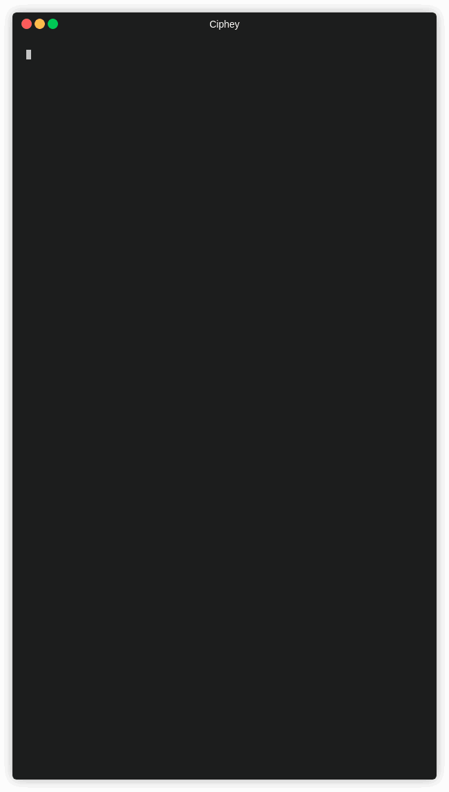

<p align="center">
<p align="center">
Terjemahan <br>
<a href=https://github.com/Ciphey/Ciphey/tree/master/README.md>🇬🇧 EN   </a>
<a href=https://github.com/Ciphey/Ciphey/tree/master/translations/de/README.md>🇩🇪 DE   </a>
<a href=https://github.com/Ciphey/Ciphey/tree/master/translations/hu/README.md>🇭🇺 HU   </a>
<a href=https://github.com/Ciphey/Ciphey/tree/master/translations/nl/README.md>🇳🇱 NL   </a>


 <br><br>
➡️ 
<a href="https://github.com/Ciphey/Ciphey/wiki">Dokumentasi</a> |
<a href="https://discord.ciphey.online">Discord</a> |
 <a href="https://github.com/Ciphey/Ciphey/wiki/Installation">Petunjuk Instalasi</a>
 ⬅️

<br>
  
</p>

<p align="center">
  

 
  <a href="https://discord.gg/wM3scnc"></a>
<a href="https://pypi.org/project/ciphey/"></a>
  
  
  
<br>
Alat dekripsi otomatis yang menggunakan pemrosesan bahasa alami & kecerdasan buatan, bersama dengan beberapa akal sehat.
</p>
<hr>

## [Petunjuk Instalasi](https://github.com/Ciphey/Ciphey/wiki/Installation)

| <p align="center"><a href="https://pypi.org/project/ciphey">🐍 Python | <p align="center"><a href="https://pypi.org/project/ciphey">🐋 Docker (Universal) |
| --------------------------- | ---------------------------------|
| <p align="center"></p> | <p align="center"></p> |
| `python3 -m pip install ciphey --upgrade`  | `docker run -it --rm remnux/ciphey` |                                                | 

| Linux       | Mac OS | Windows     |
| ----------- | ------ | ----------- |
|  | |  |
  

<hr>

# 🤔 Apa itu Ciphey?
Ciphey adalah sebuah alat dekripsi otomatis. Masukkan teks terenkripsi, dapatkan kembali teks yang didekripsi
> "Jenis enkripsi apa?"

Itulah intinya. Anda tidak tahu, Anda hanya tahu itu mungkin dienkripsi. Ciphey akan mencari tahu untuk Anda.

Ciphey dapat mendekripsi kebanyakan hal dalam 3 detik atau kurang.

<p align="center" href="https://asciinema.org/a/336257">
  
</p>

**Detail teknis** Ciphey mengunakan modul kecerdasan buatan (_AuSearch_) dengan sebuah _Antarmuka Deteksi Cipher_ untuk memperkirakan enkripsi teks yang diberikan. Dan kemudian, sebuah _Antarmuka Pemerika Bahasa_ yang dibuat khusus dipakai untuk mendeteksi kapan teks yang diberikan sudah terdekripsi.

Dan itu hanya baru puncak dari gunung es. Untuk penjelasan teknis yang lebih lengkap, lihat [dokumentasi](https://github.com/Ciphey/Ciphey/wiki) kita.

# ✨ Fitur-fitur

- **Lebih dari 20 jenis enkripsi didukung** seperti penyandian (binary, base64) dan enkripsi normal seperti cipher Caesar, Transposisi dan banyak lagi. **[Untuk daftar lengkap, klik disini](https://github.com/Ciphey/Ciphey/wiki/Supported-Ciphers)**
- **Ciphey mengunakan modul kecerdasan buatan dengan Pencarian Bertambah (_AuSearch_) untuk menjawab pertanyaan "enkripsi apa yang digunakan?"** Ini memunkinkan dekripsi untuk membutuhkan waktu kurang dari 3 detik. 
- **Modul pemrosesan bahasa alami yang dibangun khusus** Ciphey dapat mendeteksi ketika sesuatu adalah teks biasa dengan akurasi yang sangat tinggi dan dengan cepat.
- **Dukungan Multi Bahasa** saat ini, hanya Bahasa Jerman & Inggris (dengan varian AU, UK, CAN, USA) yang tersedia.
- **Mendukung enkripsi** yang alternatif seperti CyberChef Magic tidak memiliki. 
- **[Memakai inti C++](https://github.com/Ciphey/CipheyCore)** Sangat Cepat.

# 🔭 Ciphey vs CyberChef

## 🔁 Dikodekan Base64 42 kali

<table>
  <tr>
  <th>Name</th>
    <th>⚡ Ciphey ⚡ </th>
    <th>🐢 CyberChef 🐢</th>
  </tr>
  <tr>
  <th>Gif</th>
    <td></td>
    <td></td>
  </tr>
  <tr>
  <th>Durasi</th>
    <td>2 detik</td>
    <td>6 detik</td>
  </tr>
    <tr>
  <th>Pemakaian</th>
    <td><ul><li>Jalankan ciphey pada file</li></ul></td>
    <td><ul><li>Setel parameter regex menjadi "{"</li><li>Anda perlu tahu berapa kali untuk mengulang</li><li>Anda harus tahu teksnya dikodekan dengan Base64 sepenuhnya</li><li>Anda perluh memuat CyberChef (sebuah aplikasi JS yang besar)</li><li>Cukup tahu tentang CyberChef untuk menggunakannya dalam hal ini</li></ul></td>
  </tr>
</table>


<sub><b>Catatan</b> Gif diatas dapat memuat pada waktu yang berbeda sehingga satu terlihat jauh lebih cepat daripada yang lain.</sub><br>
<sub><b>Sebuah catatan tentang magic,</b> fitur CyberChef's yang paling mirip Ciphey. Magic gagal secara instan pada input ini dan cara satu-satunya untuk memaska CyberChef bersaing adalah untuk mendefinisikannya secara manual.</sub>


Kami juga menguji CyberChef dan Ciphey dengan file sebesar **6gb**. Ciphey memecahkannya dalam **5 menit dan 54 detik** dan CyberChef gagal bahkan sebelum memulai.


## 📊 Ciphey vs Katana vs CyberChef Magic

| **Name**                                   | ⚡ Ciphey ⚡ | 🤡 Katana 🤡 | 🐢 CyberChef Magic 🐢 |
| ------------------------------------------ | ---------- | ---------- | ------------------- |
| Pemerika Bahasa yang Mahir                 | ✅         | ❌         | ✅                  |
| Mendukung Enkripsi                         | ✅         | ✅         | ❌                  |
| Rilis diberi nama sesuai tema Dystopian 🌃 | ✅         | ❌         | ❌                  |
| Mendukung Fungsi Hash                      | ✅         | ✅         | ❌                  |
| Mudah dipakai                              | ✅         | ❌         | ✅                  |
| Dapat menebak enkripsi yang dipakai        | ✅         | ❌         | ❌                  |
| Dibuat untuk peretas oleh peretas          | ✅         | ✅         | ❌                  |

# 🎬 Getting Started

If you're having trouble with installing Ciphey, [read this.](https://github.com/Ciphey/Ciphey/wiki/Common-Issues-&-Their-Solutions)

## ‼️ Important Links (Docs, Installation guide, Discord Support)

| Petunjuk Instalasi | Dokumentasi | Discord |
| ------------------ | ------------- | ------- |
| 📖 [Petunjuk Instalasi](https://github.com/Ciphey/Ciphey/wiki/Installation) | 📚 [Dokumentasi](https://github.com/Ciphey/Ciphey/wiki) | 🦜 [Discord](https://discord.ciphey.online)

## 🏃‍♀️Menggunakan Ciphey
Ada 3 cara untuk memakai Ciphey.
1. Input File `ciphey - encrypted.txt`
2. Input Unqualified `ciphey -- "Teks terenkripsi di sini"`
3. Cara Biasa `ciphey -t "Teks terenkripsi di sini"`


Untuk menyingkirkan progress bar, tabel probabilitas, dan lain-lain gunakan mode senyap.

```ciphey -t "teks terenkripsi di sini" -q```

Untuk daftar argumen lengkap, jalankan `ciphey --help`.

### ⚗️ Mengimpor Ciphey
Anda dapat mengimpor file utama Ciphey dan menggunakannya dalam program dan kode Anda sendiri. `from Ciphey.__main__ import main`

# 🎪 Kontributor
Ciphey dibuat oleh [Brandon Skerritt](https://github.com/brandonskerritt) pada 2008, and dihidupkan kembali pada 2019. Ciphey tidak akan berada di ia berada tanpa [Cyclic3](https://github.com/Cyclic3) - presiden Cyber Security Society UoL.

Ciphey dihidupkan & diciptakan kembali oleh [Cyber Security Society](https://www.cybersoc.cf/) untuk digunakan dalam CTFs. Jika Anda pernah berada di Liverpool, pertimbangkan untuk memberi ceramah atau mensponsori acara kami. Kirimkan email kepada kami di `cybersecurity@society.liverpoolguild.org` untuk mengetahui lebih lanjut 🤠

**Kredit Besar** kepada George H untuk mengetahui bagaimana kami dapat menggunakan algoritma yang tepat untuk mempercepat proses pencarian. \
**Terima kasih khusus** untuk [varghalladesign](https://www.facebook.com/varghalladesign) untuk mendesain logo. Lihat karya desain mereka yang lain!

## 🐕‍🦺 [Berkontribusi](CONTRIBUTING.md)
Jangan takut untuk berkontribusi! Kami memiliki banyak, banyak hal yang dapat Anda lakukan untuk membantu. Masing-masing diberi label dan mudah dijelaskan dengan contoh-contoh. Jika Anda mencoba berkontribusi tetapi macet, tag @brandonskerritt di sebuah GitHub issue ✨

Atau, bergabung dengan grup Discord kita dan kirim pesan di sana (link di [file contribusi](CONTRIBUTING.md)) atau di bagian atas README ini sebagai lencana.

Silakan baca [file kontribusi](CONTRIBUTING.md) untuk detail yang tepat tentang cara berkontribusi ✨

## 💰 Kontributor Keuangan
Semua kontribusi akan digunakan untuk mendanai tidak hanya masa depan Ciphey dan penulisnya, tetapi juga Cyber Security Society di Universitas Liverpool.

GitHub tidak mendukung "mensponsori proyek ini dan kami akan mendistribusikan uang secara merata", jadi salah satu link dan kami akan mengatasinya di pihak kami 🥰

## ✨ Kontributor

Terima kasih kepada orang-orang hebat ini ([kunci emoji](https://allcontributors.org/docs/en/emoji-key)):

<!-- ALL-CONTRIBUTORS-LIST:START - Do not remove or modify this section -->
<!-- prettier-ignore-start -->
<!-- markdownlint-disable -->
<table>
  <tr>
    <td align="center"><a href="https://skerritt.blog"><br /><sub><b>Brandon</b></sub></a><br /><a href="#design-brandonskerritt" title="Design">🎨</a> <a href="#maintenance-brandonskerritt" title="Maintenance">🚧</a> <a href="https://github.com/Ciphey/Ciphey/commits?author=brandonskerritt" title="Code">💻</a> <a href="#ideas-brandonskerritt" title="Ideas, Planning, & Feedback">🤔</a></td>
    <td align="center"><a href="https://github.com/Cyclic3"><br /><sub><b>cyclic3</b></sub></a><br /><a href="#design-cyclic3" title="Design">🎨</a> <a href="#maintenance-cyclic3" title="Maintenance">🚧</a> <a href="https://github.com/Ciphey/Ciphey/commits?author=cyclic3" title="Code">💻</a> <a href="#ideas-cyclic3" title="Ideas, Planning, & Feedback">🤔</a></td>
    <td align="center"><a href="https://github.com/michalani"><br /><sub><b>michalani</b></sub></a><br /><a href="https://github.com/Ciphey/Ciphey/commits?author=michalani" title="Code">💻</a></td>
    <td align="center"><a href="https://github.com/ashb07"><br /><sub><b>ashb07</b></sub></a><br /><a href="https://github.com/Ciphey/Ciphey/commits?author=ashb07" title="Code">💻</a></td>
  </tr>
</table>

<!-- markdownlint-enable -->
<!-- prettier-ignore-end -->
<!-- ALL-CONTRIBUTORS-LIST:END -->

Proyek ini mengikuti spesifikasi [all-contributors](https://github.com/all-contributors/all-contributors). Kontribusi dalam bentuk apa pun dianjurkan!
