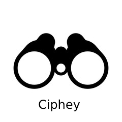
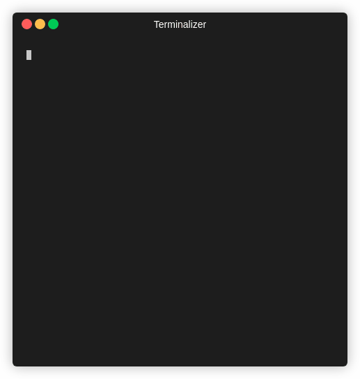
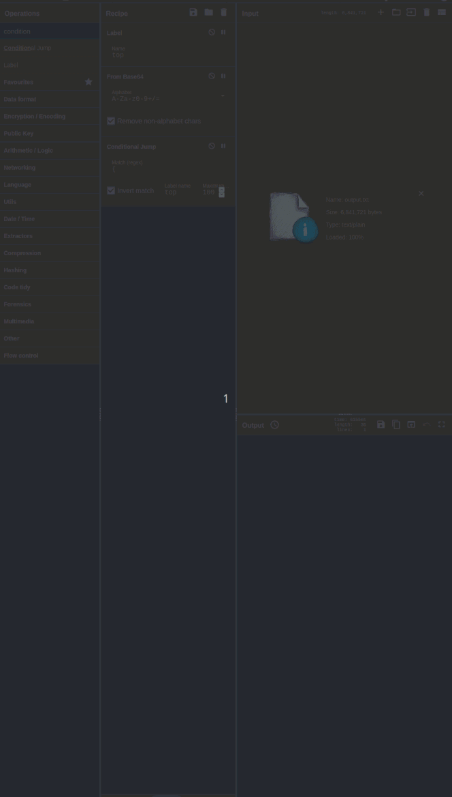
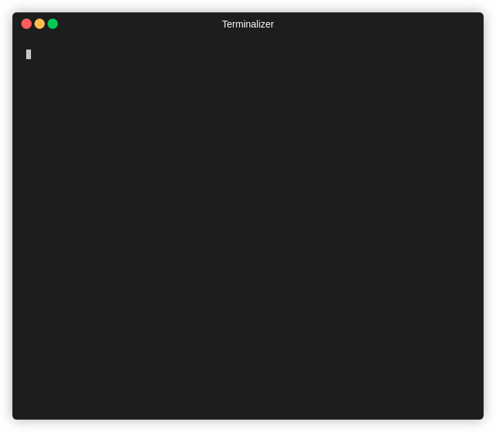

<p align="center">
翻译 <br>
<a href=https://github.com/Ciphey/Ciphey/tree/master/translations/id/README.md>🇮🇩 ID   </a>
<a href=https://github.com/Ciphey/Ciphey/tree/master/translations/de/README.md>🇩🇪 DE   </a>
<a href=https://github.com/Ciphey/Ciphey/tree/master/translations/hu/README.md>🇭🇺 HU   </a>
<a href=https://github.com/Ciphey/Ciphey/tree/master/translations/pt-br/README.md>🇧🇷 PT-BR   </a>
<a href=https://github.com/Ciphey/Ciphey/blob/master/translations/ru/readme.md>🇷🇺 RU   </a> 
 <br><br>
➡️ 
<a href="https://github.com/Ciphey/Ciphey/wiki">文献资料</a> |
<a href="https://discord.ciphey.online">Discord 链接</a> |
 <a href="https://github.com/Ciphey/Ciphey/wiki/Installation">安装指南</a>
 ⬅️

<br>
  
</p>

<p align="center">
  

 
  <a href="https://discord.gg/wM3scnc"></a>
<a href="https://pypi.org/project/ciphey/"></a>
  

  
  
<br>
使用自然语言处理和人工智能以及一些全自动解密/解码/破解工具。
</p>
<hr>

## [安装指南](https://github.com/Ciphey/Ciphey/wiki/Installation)

| <p align="center"><a href="https://pypi.org/project/ciphey">🐍 Python | <p align="center"><a href="https://pypi.org/project/ciphey">🐋 Docker (普遍) |
| --------------------------- | ---------------------------------|
| <p align="center"></p> | <p align="center"></p> |
| `python3 -m pip install ciphey --upgrade`  | `docker run -it --rm remnux/ciphey` | 


| Linux       | Mac OS | Windows     |
| ----------- | ------ | ----------- |
|  | |  |
  

<hr>

# 🤔 这是什么?
输入加密的文本，取回解密的文本。

> "什么类型的加密?"

这才是重点。您不知道，只是知道它可能已加密。 Ciphey将为您解决。

Ciphey可以在3秒或更短的时间内解密大多数加密的文本。

<p align="center" href="https://asciinema.org/a/336257">
  
</p>

Ciphey旨在成为一种工具，用于自动执行许多解密和解码，例如多种基本编码，经典密码，哈希或更高级的加密技术。

如果您对密码学不太了解，或者想在自己进行密文处理之前快速检查密文，那么Ciphey就是您的理想之选。

**技术部分.** Ciphey使用一个带有密文检测接口(_Cipher Detection Interface_)的定制AI模型(_AuSearch_)来估测一个东西是用什么方式加密的。以及一个定制过的自然语言处理接口(_Language Checker Interface_)来检测给定文本何时变为纯文本。

这里没有神经网络或缓慢的AI。我们只使用快速和最小的东西。

那只是冰山一角. 如果您要完整的技术部分的解释, 看看我们的[文档](https://github.com/Ciphey/Ciphey/wiki).

# ✨ 特性

- **支持30+的加密方法** 例如编码（二进制，base64）和常规加密（例如Caesar密码，重复密钥XOR等）。 **[有关完整列表，请单击此处](https://github.com/Ciphey/Ciphey/wiki/Supported-Ciphers)**
- **具有增强搜索功能的定制人工智能（AuSearch）可以回答“使用了哪种加密技术?"** 解密时间不到3秒。
- **定制的自然语言处理系统** Ciphey 可以确定某些东西是否是纯文本。无论该纯文本是JSON，CTF标志还是英语Ciphey，都可以在几毫秒内获得它。
- **多国语言支持** 目前，仅有德语和英语（带有AU，UK，CAN，USA变体）。
- **支持加密和哈希** 诸如CyberChef Magic之类的替代品则没有。
- **[C++ 核心](https://github.com/Ciphey/CipheyCore)** 这会使整个过程变得非常快。

# 🔭 Ciphey 与 CyberChef 的对比

## 🔁 Base64加密42次

<table>
  <tr>
  <th>名字</th>
    <th>⚡ Ciphey ⚡ </th>
    <th>🐢 CyberChef 🐢</th>
  </tr>
  <tr>
  <th>Gif</th>
    <td></td>
    <td></td>
  </tr>
  <tr>
  <th>时间</th>
    <td>2 秒</td>
    <td>6 秒</td>
  </tr>
    <tr>
  <th>建立</th>
    <td><ul><li>在文件上运行ciphey</li></ul></td>
    <td><ul><li>将正则表达式参数设置为 "{"</li><li>您需要知道要重复多少次</li><li>您需要一直知道它是使用Base64加密法</li><li>您需要运行 CyberChef (它是一个超级超级慢的JS 应用程序)</li><li>对CyberChef有足够了解以创建此管道</li><li>反转匹配</li></ul></td>
  </tr>
</table>


<sub><b>Note</b> 这些gif可能在不同的时间加载，因此一个gif的显示速度可能明显快于另一个.</sub><br>
<sub><b>A note on magic</b> CyberChef与Ciphey最相似的功能是Magic。Magic在此输入上立即失败并崩溃。我们迫使CyberChef竞争的唯一方法是手动定义它。</sub>


我们还使用**6gb文件**测试了CyberChef和Ciphey。Ciphey在5分钟54秒内破解了它。CyberChef在开始之前就系统崩溃了。


## 📊 Ciphey 和 Katana 和 CyberChef Magic 的对比

| **名字**                                   | ⚡ Ciphey ⚡ | 🗡️ Katana 🗡️ | 🐢 CyberChef Magic 🐢 |
| ------------------------------------------ | ---------- | ---------- | ------------------- |
| 高级语言检查器                              | ✅          | ❌          | ✅                   |
| 支持加密法                                  | ✅          | ✅          | ❌                   |
| 以反乌托邦主题命名的发行🌃                   | ✅          | ❌          | ❌                   |
| 支持哈希算法                                | ✅          | ✅          | ❌                   |
| 易于设置                                    | ✅          | ❌          | ✅                   |
| 可以猜测使用什么加密                         | ✅          | ❌          | ❌                   |
| 由黑客为黑客创建                              | ✅          | ✅          | ❌                   |

# 🎬 入门

如果您在安装Ciphey时遇到问题，请 [阅读此内容](https://github.com/Ciphey/Ciphey/wiki/Common-Issues-&-Their-Solutions)

## ‼️ 重要链接（文档，安装指南，Discord链接）

| 安装指南            | 文献资料      | Discord | Docker 图像（来自REMnux）
| ------------------ | ------------- | ------- | ------- | 
| 📖 [安装指南](https://github.com/Ciphey/Ciphey/wiki/Installation) | 📚 [文献资料](https://github.com/Ciphey/Ciphey/wiki) | 🦜 [Discord](https://discord.ciphey.online) | 🐋 [Docker 文献资料](https://docs.remnux.org/run-tools-in-containers/remnux-containers#ciphey)

## 🏃‍♀️运行 Ciphey
有3种方式可以运行Ciphey。
1. 文件输入 `ciphey -f encrypted.txt`
2. 不合格输入 `ciphey -- "Encrypted input"`
3. 正常方式 `ciphey -t "Encrypted input"`



要消除进度条，概率表和所有杂音，请使用安静模式。

```ciphey -t "encrypted text here" -q```

有关命令的完整列表，请运行 `ciphey --help`.

### ⚗️ 导入Ciphey
您可以导入Ciphey\'s main，并在您自己的程序和代码中使用它。 `from Ciphey.__main__ import main`

# 🎪 贡献者
Ciphey是由[Brandon](https://github.com/bee-san)在2008年发明的，并在2019年重写。如果没有[Cyclic3](https://github.com/Cyclic3) - UoL网络安全协会主席，Ciphey将不会是今天的样子 

Ciphey由[网络安全协会](https://www.cybersoc.cf/)进行了复兴和重建以用于CTF。如果您曾经在利物浦，请考虑发表演讲或赞助我们的活动。给我们发电子邮件 `cybersecurity@society.liverpoolguild.org` 以了解更多🤠

**主要信用** 感谢George H找出如何使用适当的算法来加快搜索过程。
**特别感谢** 至 [varghalladesign](https://www.facebook.com/varghalladesign) 用于设计徽标。查看他们的其他设计工作！

## 🐕‍🦺 [参与贡献](https://github.com/Ciphey/Ciphey/wiki/Contributing)
不要害怕参与！您可以做很多事情来帮助我们。它们每个都带有标签，并通过示例轻松解释。如果您想贡献但被停止，请在GitHub问题中标记 @bee-san或 @cyclic3✨

或者，加入Discord群组并在那里发送消息（链接在 [贡献文件](https://github.com/Ciphey/Ciphey/wiki/Contributing)）或在本自述文件的顶部的徽章。

请阅读 [参与贡献文件](https://github.com/Ciphey/Ciphey/wiki/Contributing) 有关如何参与制作的细节 ✨

By doing so, you'll get your name added to the README below and get to be apart of an ever-growing project!
[](https://starchart.cc/Ciphey/Ciphey)
## 💰 财务贡献者
这些捐款将不仅用于资助Ciphey及其作者的未来，而且还将用于利物浦大学的网络安全协会。

GitHub不支持“赞助此项目，我们将平均分配资金”，因此选择一个链接，我们将对其进行最终整理 🥰

## ✨ Contributors
感谢这些很棒的人([表情符号](https://allcontributors.org/docs/en/emoji-key)):

<!-- ALL-CONTRIBUTORS-LIST:START - Do not remove or modify this section -->
<!-- prettier-ignore-start -->
<!-- markdownlint-disable -->
<table>
  <tr>
    <td align="center"><a href="https://github.com/Cyclic3"><br /><sub><b>cyclic3</b></sub></a><br /><a href="#design-cyclic3" title="Design">🎨</a> <a href="#maintenance-cyclic3" title="Maintenance">🚧</a> <a href="https://github.com/Ciphey/Ciphey/commits?author=cyclic3" title="Code">💻</a> <a href="#ideas-cyclic3" title="Ideas, Planning, & Feedback">🤔</a></td>
    <td align="center"><a href="https://skerritt.blog"><br /><sub><b>Brandon</b></sub></a><br /><a href="#design-brandonskerritt" title="Design">🎨</a> <a href="#maintenance-brandonskerritt" title="Maintenance">🚧</a> <a href="https://github.com/Ciphey/Ciphey/commits?author=brandonskerritt" title="Code">💻</a> <a href="#ideas-brandonskerritt" title="Ideas, Planning, & Feedback">🤔</a></td>
    <td align="center"><a href="https://github.com/michalani"><br /><sub><b>michalani</b></sub></a><br /><a href="https://github.com/Ciphey/Ciphey/commits?author=michalani" title="Code">💻</a></td>
    <td align="center"><a href="https://github.com/ashb07"><br /><sub><b>ashb07</b></sub></a><br /><a href="https://github.com/Ciphey/Ciphey/commits?author=ashb07" title="Code">💻</a></td>
    <td align="center"><a href="https://github.com/TheAlcanian"><br /><sub><b>Shardion</b></sub></a><br /><a href="https://github.com/Ciphey/Ciphey/issues?q=author%3ATheAlcanian" title="Bug reports">🐛</a></td>
    <td align="center"><a href="https://github.com/Bryzizzle"><br /><sub><b>Bryan</b></sub></a><br /><a href="#translation-Bryzizzle" title="Translation">🌍</a> <a href="https://github.com/Ciphey/Ciphey/commits?author=Bryzizzle" title="Documentation">📖</a></td>
    <td align="center"><a href="https://lukasgabriel.net"><br /><sub><b>Lukas Gabriel</b></sub></a><br /><a href="https://github.com/Ciphey/Ciphey/commits?author=lukasgabriel" title="Code">💻</a> <a href="https://github.com/Ciphey/Ciphey/issues?q=author%3Alukasgabriel" title="Bug reports">🐛</a> <a href="#translation-lukasgabriel" title="Translation">🌍</a> <a href="#ideas-lukasgabriel" title="Ideas, Planning, & Feedback">🤔</a></td>
  </tr>
  <tr>
    <td align="center"><a href="https://github.com/DarshanBhoi"><br /><sub><b>Darshan</b></sub></a><br /><a href="https://github.com/Ciphey/Ciphey/issues?q=author%3ADarshanBhoi" title="Bug reports">🐛</a></td>
    <td align="center"><a href="https://github.com/SkeletalDemise"><br /><sub><b>SkeletalDemise</b></sub></a><br /><a href="https://github.com/Ciphey/Ciphey/commits?author=SkeletalDemise" title="Code">💻</a></td>
    <td align="center"><a href="https://www.patreon.com/cclauss"><br /><sub><b>Christian Clauss</b></sub></a><br /><a href="https://github.com/Ciphey/Ciphey/commits?author=cclauss" title="Code">💻</a> <a href="https://github.com/Ciphey/Ciphey/issues?q=author%3Acclauss" title="Bug reports">🐛</a></td>
    <td align="center"><a href="http://machinexa.xss.ht"><br /><sub><b>Machinexa2</b></sub></a><br /><a href="#content-machinexa2" title="Content">🖋</a></td>
    <td align="center"><a href="https://github.com/anantverma275"><br /><sub><b>Anant Verma</b></sub></a><br /><a href="https://github.com/Ciphey/Ciphey/commits?author=anantverma275" title="Code">💻</a> <a href="https://github.com/Ciphey/Ciphey/issues?q=author%3Aanantverma275" title="Bug reports">🐛</a></td>
    <td align="center"><a href="https://github.com/XVXTOR"><br /><sub><b>XVXTOR</b></sub></a><br /><a href="https://github.com/Ciphey/Ciphey/commits?author=XVXTOR" title="Documentation">📖</a></td>
    <td align="center"><a href="https://github.com/Itamikame"><br /><sub><b>Itamikame</b></sub></a><br /><a href="https://github.com/Ciphey/Ciphey/commits?author=Itamikame" title="Code">💻</a></td>
  </tr>
  <tr>
    <td align="center"><a href="https://github.com/MikeMerz"><br /><sub><b>MikeMerz</b></sub></a><br /><a href="https://github.com/Ciphey/Ciphey/commits?author=MikeMerz" title="Code">💻</a></td>
    <td align="center"><a href="https://github.com/jacobggman"><br /><sub><b>Jacob Galam</b></sub></a><br /><a href="https://github.com/Ciphey/Ciphey/commits?author=jacobggman" title="Code">💻</a> <a href="https://github.com/Ciphey/Ciphey/issues?q=author%3Ajacobggman" title="Bug reports">🐛</a></td>
    <td align="center"><a href="https://tuxthexplorer.github.io/"><br /><sub><b>TuxTheXplorer</b></sub></a><br /><a href="#translation-TuxTheXplorer" title="Translation">🌍</a></td>
    <td align="center"><a href="https://github.com/Itamai"><br /><sub><b>Itamai</b></sub></a><br /><a href="https://github.com/Ciphey/Ciphey/commits?author=Itamai" title="Code">💻</a> <a href="https://github.com/Ciphey/Ciphey/issues?q=author%3AItamai" title="Bug reports">🐛</a></td>
    <td align="center"><a href="https://github.com/Termack"><br /><sub><b>Filipe</b></sub></a><br /><a href="#translation-Termack" title="Translation">🌍</a></td>
    <td align="center"><a href="https://github.com/malathit"><br /><sub><b>Malathi</b></sub></a><br /><a href="https://github.com/Ciphey/Ciphey/commits?author=malathit" title="Code">💻</a></td>
    <td align="center"><a href="https://hexchaos.xyz/"><br /><sub><b>Jack</b></sub></a><br /><a href="#translation-HexChaos" title="Translation">🌍</a></td>
  </tr>
  <tr>
    <td align="center"><a href="https://github.com/yafkari"><br /><sub><b>Younes</b></sub></a><br /><a href="#translation-yafkari" title="Translation">🌍</a></td>
  </tr>
</table>

<!-- markdownlint-enable -->
<!-- prettier-ignore-end -->
<!-- ALL-CONTRIBUTORS-LIST:END -->

该项目遵循 [all-contributors](https://github.com/all-contributors/all-contributors) 的规范。 欢迎任何形式的捐助和帮助!
